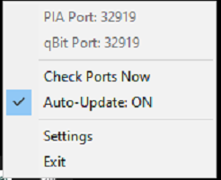
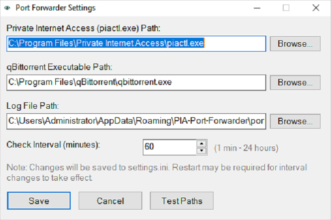

# PIA Port Forwarder for qBittorrent

> Automatically sync Private Internet Access VPN port forwarding with qBittorrent

[](https://www.autohotkey.com/)
[](LICENSE)

---

## 🎯 Problem Solved

Private Internet Access VPN randomly changes your port forward port for security. When this happens, qBittorrent continues using the old port, **breaking your torrent seeding**.

This tool **automatically detects port changes** and updates qBittorrent for you.

---

## ✨ Features

- 🔄 **Automatic Port Syncing** - Detects PIA port changes and updates qBittorrent
- ⚙️ **Configurable Paths** - Custom installation directories for PIA and qBittorrent
- ⏱️ **Adjustable Check Interval** - Set how often to check (1 min - 24 hours)
- 🔔 **Tray Notifications** - Shows current ports and alerts you to changes
- 📝 **Change Logging** - Keeps a log of all port changes with timestamps
- 🎛️ **Toggle Auto-Update** - Choose automatic updates or manual confirmation

---

## 📸 Screenshots

### Tray Menu


*Real-time port monitoring with auto-update toggle*

### Settings


*Configure program paths and check interval*

---

## 📋 Requirements

- **Windows** (any version)
- **Private Internet Access VPN** with port forwarding enabled
- **qBittorrent** torrent client

---

## 🚀 Installation

1. **Download** `PF_Watchdog.exe` from releases
2. **Move the executable** to a permanent location (not Downloads folder)
3. **Run it once** to configure settings
4. **Configure Settings** (right-click tray icon → Settings):
   - Set PIA executable path (default: `C:\Program Files\Private Internet Access\piactl.exe`)
   - Set qBittorrent path (default: `C:\Program Files\qBittorrent\qbittorrent.exe`)
   - Set log file location (default: `%AppData%\PIA-Port-Forwarder\port_changes.log`)
   - Set check interval (default: 60 minutes)
5. **Click "Test Paths"** to verify everything works
6. **Save** settings
7. **Add to Startup** (optional but recommended):
   - Press `Win+R`, type `shell:startup`, press Enter
   - Create a shortcut to the EXE in the Startup folder
   - The tool will now run automatically when Windows starts

---

## 💡 Usage

### First Time Setup
1. Run the executable
2. Right-click tray icon → **Settings**
3. Verify paths are correct (or browse to select):
   - PIA executable path
   - qBittorrent executable path
   - Log file location (can change if desired)
4. Set desired check interval
5. Click **Test Paths** to verify
6. Click **Save**

### Daily Use
The script runs in the background and:
- ✅ Checks PIA port every interval (default: hourly)
- ✅ Automatically updates qBittorrent when port changes
- ✅ Shows notification when port is updated
- ✅ Logs changes to `port_changes.log`

### Tray Menu Options
- **PIA Port / qBit Port** - View current ports
- **Check Ports Now** - Manually trigger check
- **Auto-Update: ON** - Toggle automatic updates on/off
- **Settings** - Configure paths and interval
- **Exit** - Close the script

---

## 🔧 How It Works

1. Script periodically checks PIA's port forward setting via `piactl get portforward`
2. Reads qBittorrent's current port from `qBittorrent.ini`
3. If ports don't match:
   - Closes qBittorrent gracefully
   - Updates port in configuration file
   - Restarts qBittorrent
   - Logs the change

---

## 📁 Files Created

Both files are stored in `%AppData%\PIA-Port-Forwarder\`:

- **settings.ini** - Saves your configuration (paths, interval, auto-update preference)
- **port_changes.log** - Logs all port changes with timestamps

---

## 🛠️ Configuration

Settings are stored in `%AppData%\PIA-Port-Forwarder\settings.ini`:

```ini
[Paths]
PIAPath=C:\Program Files\Private Internet Access\piactl.exe
QbitPath=C:\Program Files\qBittorrent\qbittorrent.exe
LogPath=C:\Users\YourName\AppData\Roaming\PIA-Port-Forwarder\port_changes.log

[Settings]
CheckInterval=3600000
AutoUpdate=1
```

**Note:** Both settings and logs are stored in AppData to avoid permission issues while keeping everything centralized.

---

## 🐛 Troubleshooting

**Port not updating:**
- Right-click tray → Settings → Test Paths
- Ensure PIA VPN is connected and port forwarding is enabled
- Check that qBittorrent path is correct

**"Path not found" errors:**
- Open Settings and use Browse buttons to locate correct executables
- PIA path should point to `piactl.exe`
- qBittorrent path should point to `qbittorrent.exe`

**Log file opening on startup:**
- Change the log file location in Settings to a different path
- Default location is `%AppData%\PIA-Port-Forwarder\port_changes.log`

---

## 📝 License

MIT License - Feel free to use and modify

---

## 👤 Author

**Emma Smith**

Website: [emma-tech.net](https://emma-tech.net)

---

## ⭐ Show Your Support

If this tool helped keep your torrents seeding, give it a star! ⭐
